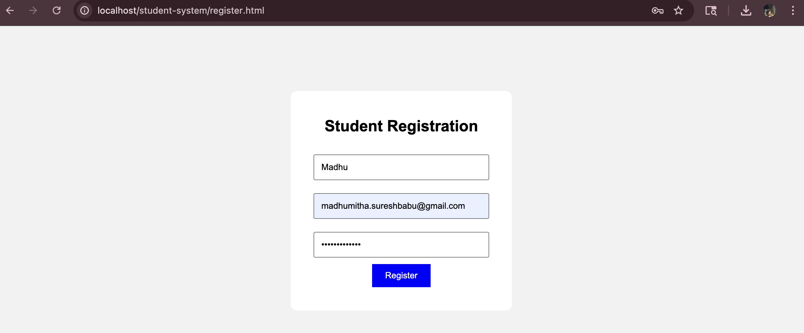
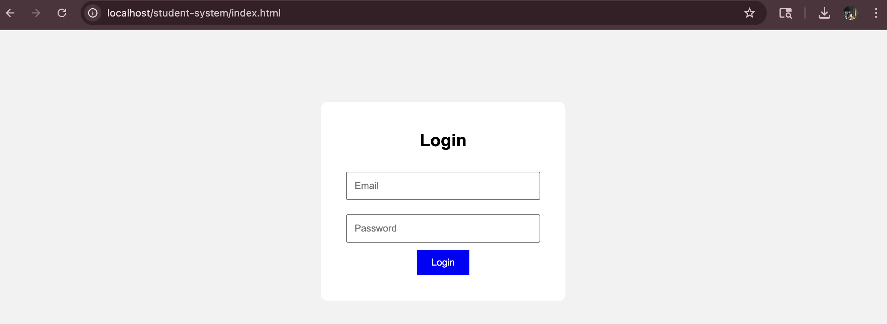
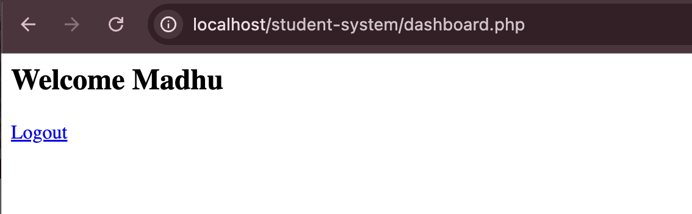

# Student Registration System

## Description
A dynamic web application that allows students to register and login using a secure system.

## Features
- User Registration
- User Login
- Client-side validation (JavaScript)
- Server-side processing (PHP)
- MySQL database connectivity

## Tech Stack
- HTML, CSS, JavaScript
- PHP
- MySQL (XAMPP)

## How to Run
1. Install XAMPP
2. Place project in htdocs
3. Start Apache & MySQL
4. Open http://localhost/student-system

## Screenshots

### Registration Page

### Login Page

### Dashboard

